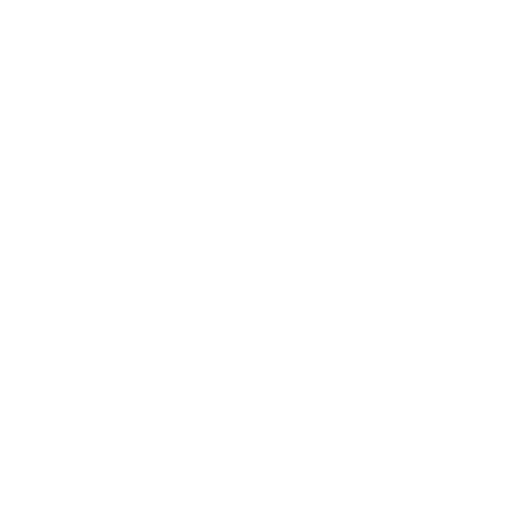

<h1 align="center">
  
</h1>

###  About Me:

  Hi, I'm Sohail Ahmad! 👋, Computer Engineer & Software Developer from Pakistan
   
<ul align="center" style="margin: 0 auto;">
  <ol>👀 I'm a Full-Stack Developer, specializing in PHP, JS, Shopify, and WordPress.</ol>
  <ol>🌱 Currently, I'm exploring creating a chatbot with chatgpt.</ol>
  <ol>💞️ I'm open to collaborations on React application development projects.</ol>
</ul>

  
  
  
  

<h2 align="center">🔥 Languages & Frameworks & Tools & Abilities 🔥</h2> 

  
  
  
  
  
  
  
  

